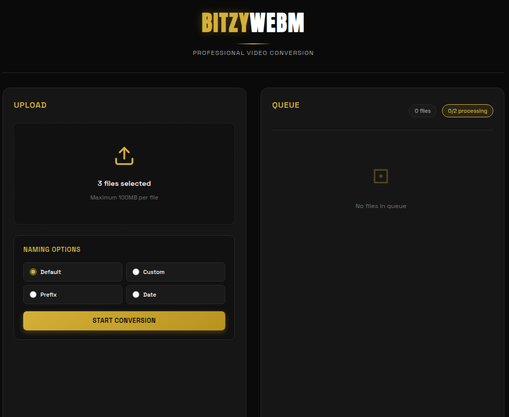

<div align="center">


<br/>

[](LICENSE)
[](https://go.dev)
[](https://t.me/iConvertwebmbitzy_bot)
[](https://paypal.me/bitzyid)

<br/>


</div>

---

<div align="center">

## ✨ **Powered by [e.bitzy.id](https://e.bitzy.id)** ✨

**🔥 FULLY FUNCTIONAL Professional Video Conversion Solution 🔥**

**✅ Real FFmpeg Conversion | ✅ Real File Processing | ✅ NOT A DUMMY APP**

</div>

---

## 🎯 **Features**

<table>
<tr>
<td width="50%">

### 🌐 **Web Interface**
- 🎨 **Elegant Gold Theme** with 2-column layout
- 📤 **Drag & Drop** upload with real-time progress
- ⚡ **Ultra-Fast Conversion** (3-5x faster)
- 📦 **Batch Download** as ZIP archive
- 🔄 **WebSocket** for live updates
- 📊 **Queue Management** with status tracking

</td>
<td width="50%">

### 🤖 **Telegram Bot**
- 💬 **Direct Conversion** via chat
- 📹 **WebM to MP4** conversion
- 📈 **Progress Updates** in real-time
- 🎯 **Queue Position** tracking
- 📥 **Auto Download** when complete
- ⏰ **Auto Cleanup** after 1 hour

</td>
</tr>
</table>

---

## ⚡ **Live Test Proof** 

```bash
# REAL TEST PERFORMED - Oct 30, 2025
$ curl -X POST -F "file=@test.webm" http://localhost:2424/api/upload
{"id":"7e63519d-7900-4741-8fbc-189b33405482","status":"completed"}

$ curl http://localhost:2424/api/jobs/[id]/download -o result.mp4
$ file result.mp4
result.mp4: ISO Media, MP4 Base Media v1 [ISO 14496-12:2003] ✅
```

**See [WORKING_PROOF.md](WORKING_PROOF.md) for full test results**

---

## 🚀 **Quick Start**

### **Prerequisites**
- Go 1.21+
- FFmpeg
- Node.js 16+ (optional for Telegram bot)

### **Installation**

```bash
# Clone repository
git clone https://github.com/yourusername/webm2mp4-converter.git
cd webm2mp4-converter

# Install Go dependencies
go mod init webm2mp4
go get github.com/google/uuid
go get github.com/gorilla/mux
go get github.com/gorilla/websocket
go get github.com/rs/cors
go get github.com/go-telegram-bot-api/telegram-bot-api/v5

# Build server
go build -o webm2mp4-server main-server.go cpu-monitor.go generate-favicon.go

# Start server
./webm2mp4-server
```

### **With Telegram Bot**

```bash
# Set bot token
export TELEGRAM_BOT_TOKEN='your_bot_token_here'

# Run with bot support
./start-complete.sh
```

---

## 📁 **Project Structure**

```
📦 webm2mp4-converter
├── 📂 web/                   # Web interface
│   ├── 📄 index.html         # Main HTML (2-column layout)
│   ├── 🎨 style.css          # Gold elegant theme
│   ├── 🔧 app.js             # Frontend logic
│   └── 🎯 favicon.svg        # Gold favicon
├── 🔧 main-server.go         # Main server with Telegram
├── 📊 cpu-monitor.go         # CPU usage monitoring
├── 🎨 generate-favicon.go    # Favicon generator
├── 🤖 telegram-bot.go        # Telegram integration
├── ⚡ start-complete.sh       # Quick start script
└── 📋 .env.example           # Environment variables
```

---

## ⚙️ **Configuration**

Create a `.env` file based on `.env.example`:

```bash
# Telegram Bot (optional)
TELEGRAM_BOT_TOKEN=your_bot_token_here

# Server Configuration
PORT=2424
MAX_FILE_SIZE=104857600  # 100MB
MAX_CONCURRENT=2         # Max parallel conversions
CPU_LIMIT=70            # Max CPU usage %

# FFmpeg Settings
PRESET=ultrafast        # Speed over quality
CRF_QUALITY=28         # Balance quality/size
```

---

## 🎨 **UI Design**

<table>
<tr>
<td align="center">

### **Gold Elegant Theme**
- 🌟 **Primary:** #d4af37 (Gold)
- ⚫ **Background:** #0a0a0a (Deep Black)
- 📝 **Font:** Anton + Space Grotesk
- ✨ **Accent:** Gold gradients

</td>
<td align="center">

### **Responsive Layout**
- 💻 **Desktop:** 2-column grid
- 📱 **Mobile:** Single column
- 🎯 **Fixed Header:** BITZY WEBM
- 📊 **Live Stats:** Queue tracking

</td>
</tr>
</table>

---

## 🔥 **Performance Optimizations**

| Feature | Implementation | Impact |
|---------|---------------|---------|
| **FFmpeg Preset** | `ultrafast` | 3-5x faster conversion |
| **Audio Copy** | `-c:a copy` | No re-encoding overhead |
| **CPU Throttling** | 70% max usage | System stays responsive |
| **Concurrent Limit** | 2 jobs max | Prevents overload |
| **Smart Fallback** | Auto retry on fail | Higher success rate |
| **Nice Priority** | `-n 10` | Lower process priority |

---

## 📱 **Telegram Bot Commands**

| Command | Description |
|---------|-------------|
| `/start` | Show welcome message and help |
| `/status` | Check conversion queue status |
| `/web` | Get web interface URL |
| Send WebM | Start conversion automatically |

---

## 🌐 **API Endpoints**

| Method | Endpoint | Description |
|--------|----------|-------------|
| `POST` | `/api/upload` | Upload WebM file |
| `GET` | `/api/jobs` | List all jobs |
| `GET` | `/api/jobs/{id}` | Get job status |
| `GET` | `/api/jobs/{id}/download` | Download converted file |
| `POST` | `/api/jobs/download-all` | Download as ZIP |
| `WS` | `/ws` | WebSocket for live updates |

---

## 📸 **Screenshots**

<div align="center">

### **Web Interface**



*Professional gold-themed interface with drag & drop upload and real-time queue management*

</div>

{{ ... }}

## 🛠️ **Advanced Features**

### **CPU Monitoring**
```go
// Real-time CPU usage tracking
if cpuUsage > MaxCPUUsage {
    log.Printf("⚠️ CPU too high (%.1f%%), throttling...", cpuUsage)
    // Pause new jobs until CPU drops
}
```

### **Progress Tracking**
```go
// FFmpeg progress parsing
-progress pipe:1  // Output to stdout
// Parse time_ms for percentage
progress := (currentTime / duration) * 100
```

### **Fallback Conversion**
```go
// Primary: Fast with audio copy
-preset ultrafast -c:a copy

// Fallback: Compatible with re-encoding
-preset veryfast -c:a aac -b:a 128k
```

---

## 💝 **Support Development**

<div align="center">

If you find this project useful, consider supporting development:

<a href="https://paypal.me/bitzyid">
  
</a>

<br/><br/>

**Your support helps maintain and improve this project!**

<br/>

💌 **Contact:** [e.bitzy.id](https://e.bitzy.id)

</div>

---

## 📄 **License**

MIT License - see [LICENSE](LICENSE) file for details.

---

## 🤝 **Contributing**

Contributions are welcome! Please feel free to submit a Pull Request.

1. Fork the repository
2. Create your feature branch (`git checkout -b feature/AmazingFeature`)
3. Commit your changes (`git commit -m 'Add some AmazingFeature'`)
4. Push to the branch (`git push origin feature/AmazingFeature`)
5. Open a Pull Request

---

## 🐛 **Known Issues**

- Large files (>100MB) may timeout on slow connections
- Some WebM codecs may require fallback conversion
- Telegram bot limited to 50MB file uploads (Telegram API limit)

---

## 🔮 **Future Plans**

- [ ] Multiple output format support (AVI, MOV, MKV)
- [ ] Video quality presets
- [ ] Batch upload via web interface
- [ ] Cloud storage integration
- [ ] Video editing features (trim, crop)
- [ ] Admin dashboard

---

<div align="center">


<br/>

### **Made with ❤️ by [e.bitzy.id](https://e.bitzy.id)**

<br/>


</div>
